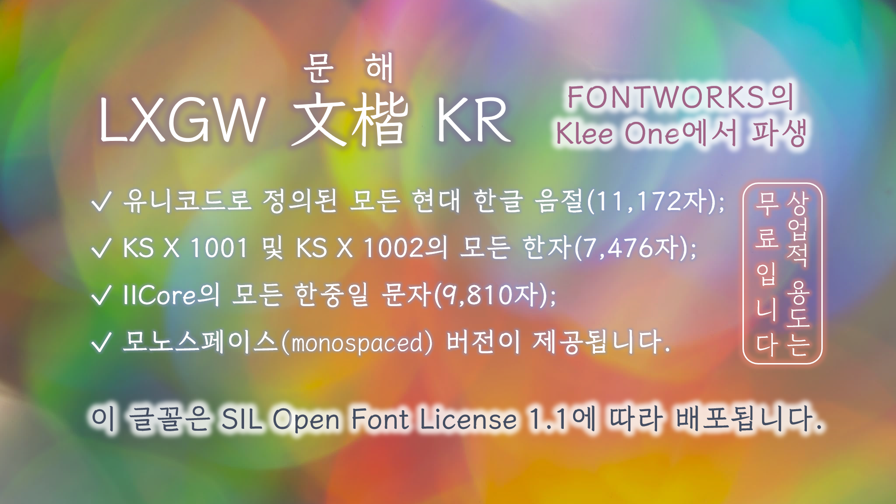

> [!NOTE]
> 다음 한국어 콘텐츠는 DeepL 에서 번역한 것으로 정확성을 보장하지 않을 수 있습니다. 영어 또는 중국어 사용설명서 파일을 참조하세요.

[English](./README.md) | 한국어 | [繁體中文](./README-CHT.md) 
#  LXGW 문해 KR / LXGW WenKai KR / 霞鶩文楷 KR
[LXGW WenKai](https://github.com/lxgw/LxgwWenKai)의 한글판.
## 소개
LXGW 문해(文楷) KR은 연필이나 펜으로 손으로 쓴 스크립트 글꼴로, 프란시스 차우가 처음 디자인한 Fontworks의 [Klee One](https://github.com/fontworks-fonts/Klee)에서 파생된 오픈 소스 글꼴입니다. 이 글꼴은 한글 타이포그래피용으로 제작되었으며, 현대 한글 음절과 몇 가지 한자를 모두 포함하고 있습니다. 
또한 코딩을 위한 모노스페이스 버전도 제공합니다.
### 문자
- 유니코드로 정의된 모든 현대 한글 음절(11,172자);
- KS X 1001 및 KS X 1002의 모든 한자(4,620 + 2,856 = 7,476자);
- [IICore](https://github.com/NightFurySL2001/CJK-character-count/blob/master/iicore-han.txt)의 모든 한중일 문자(9,810자);
- 대부분의 라틴 문자, 구두점 및 기호 LXGW WenKai.
## 글꼴 가져오기
### 글꼴 파일 다운로드
최신 출시 글꼴은 [릴리즈](https://github.com/lxgw/LxgwWenKaiKR/releases) 페이지에서 다운로드할 수 있습니다. 미리 빌드된 폰트 파일은 `fonts/TTF` 폴더에서 다운로드할 수도 있습니다.
### 소스로부터 폰트 빌드하기
`make build`로 전체 빌드 과정을 실행할 수 있습니다. 현재 소스 코드는 유닉스 계열 시스템에서만 실행할 수 있으며 파이썬 3이 설치되어 있어야 합니다.
## 라이선스
이 글꼴은 [SIL Open Font License 1.1](https://openfontlicense.org)에 따라 배포됩니다.
### 권한
라이선스에 따라 이 글꼴을 상업적 용도로도 자유롭게 사용, 삽입, 수정 및 재배포할 수 있습니다.
### 제한 사항 
- 이 글꼴 자체를 판매할 수 없습니다.
- 이 글꼴은 SIL OFL 1.1을 제외한 라이선스에 따라 재배포할 수 없습니다.
## 저자
- 오리지널 디자이너: 프란시스 차우
- 원본 글꼴의 유형 파운드리: Fontworks(현재 Monotype K.K.)
- 파생 개발자: LXGW 
## 감사
- 한글 음절 글리프 템플릿은 [@Partyb0ssishere](https://github.com/Partyb0ssishere)와 그의 [CEF Fonts CJK](https://github.com/Partyb0ssishere/cef-fonts-cjk)가 제공했습니다.
- 일부 한자 글리프는 [@Steve-Yuu](https://github.com/Steve-Yuu)가 개발한 [Yshi Pen Shuti](https://github.com/Steve-Yuu/YshiPen-Shuti)에서 차용했습니다.
- [Iosevka](https://github.com/be5invis/Iosevka)와 [Nerd-Fonts](https://github.com/ryanoasis/nerd-fonts)에서 모노스페이스 버전용 Powerline 기호를 제공했습니다.
- 박스 드로잉 문자, 표의문자 설명 문자 및 일부 딩벳은 [본고딕](https://github.com/adobe-fonts/source-han-sans)에서 차용했습니다.
- [Aaron Bell](https://github.com/aaronbell)과 [@NightFurySL2001](https://github.com/NightFurySL2001)이 빌드 시스템을 제공하고 최적화했습니다.
