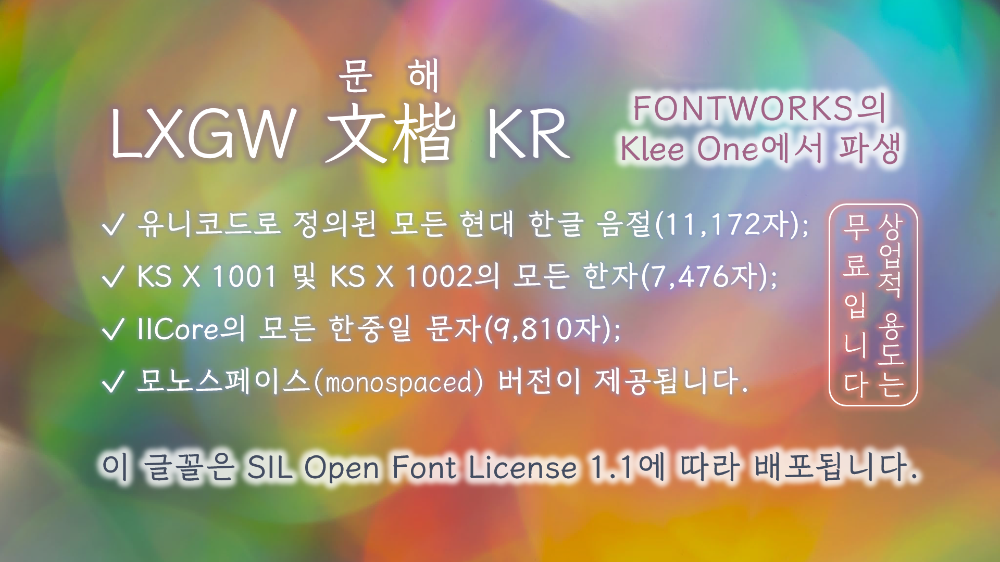

English | [한국어](./README-KR.md) | [繁體中文](./README-CHT.md) 
# LXGW WenKai KR / LXGW 문해 KR / 霞鶩文楷 KR
The Korean Edition of [LXGW WenKai](https://github.com/lxgw/LxgwWenKai).
## Introduction
LXGW WenKai KR is an open-source font derived from Fontworks' [Klee One](https://github.com/fontworks-fonts/Klee), a script font handwritten by pencil or pen and originally designed by Francis Chow. This font is made for Korean typography and contains a complete set of modern Hangul syllables and a few Hanjas. It also provides monospaced version for coding.

### Characters
- All modern Hangul syllables defined by Unicode (11,172 characters);
- All Hanjas in KS X 1001 and KS X 1002 (4,620 + 2,856 = 7,476 characters);
- All CJK characters in [IICore](https://github.com/NightFurySL2001/CJK-character-count/blob/master/iicore-han.txt) (9,810 characters);
- Most of Latin characters, punctuations and symbols in LXGW WenKai.
## Get the font
### Download the font files
You can download the latest released fonts in [Releases](https://github.com/lxgw/LxgwWenKaiKR/releases) page. You can also download the pre-built font files in [fonts/TTF](./fonts/TTF) folder.
### Build fonts from the source
You can run the complete build process with make: `make build`. The current source code can only be run on Unix-like systems and requires Python 3 to be installed.
## License
This font is distributed under [SIL Open Font License 1.1](https://openfontlicense.org).
### Permissions
According to the license, you can use, embed, modify and redistribute this font freely and free of charge, even commercial uses.
### Restrictions 
- You cannot sell this font itself.
- You cannot redistribute this font under the license except SIL OFL 1.1.
## Authors
- Original designer: Francis Chow
- Original font's type foundry: Fontworks (present Monotype K.K.)
- Derivative developer: LXGW 
## Acknowledgements
- [@Partyb0ssishere](https://github.com/Partyb0ssishere) and his [CEF Fonts CJK](https://github.com/Partyb0ssishere/cef-fonts-cjk) provided the template for Hangul syllable glyphs.
- Some hanja glyphs were borrowed from [Yshi Pen Shuti](https://github.com/Steve-Yuu/YshiPen-Shuti) developed by [@Steve-Yuu](https://github.com/Steve-Yuu).
- [Iosevka](https://github.com/be5invis/Iosevka) and [Nerd-Fonts](https://github.com/ryanoasis/nerd-fonts) provided Powerline symbols for monospaced version.
- Box drawing characters, ideographic description characters and some dingbats were borrowed from [Source Han Sans](https://github.com/adobe-fonts/source-han-sans).
- [Aaron Bell](https://github.com/aaronbell) and [@NightFurySL2001](https://github.com/NightFurySL2001) provided and optimized the build system.
